# 🏆Bki Sunnanå Headless Cms🏆
[BKI Sunnanå](https://bki-sunnana.vercel.app/) – Headless CMS Website

This repository contains the source code for BKI Sunnanå, a modern, accessible, and content-driven website built as a degree project.

## 🔍Project Overview

The goal of this project is to design and develop a conceptual, user-centered proposal for how a local sports club website could look and function with improved design, accessibility, and structure. The project is not intended to replace the existing club website, but instead to explore and demonstrate how a modern, accessible, and content-driven solution could improve the overall user experience compared to the current platform (hosted on a third-party service), which limits design freedom, accessibility, and long-term scalability. By using Payload CMS, Next.js, and Tailwind CSS, this project aims to:

- Strengthen the club’s digital identity

- Improve accessibility and usability

- Simplify content management for editors

- Create a scalable foundation for future features

- This project is developed as part of a Degree Project (Examensarbete) at Medieinstitutet.
## 📑 Table of Contents

- [🔍 Project Overview](#project-overview)
- [🎯 Purpose & Goals](#purpose--goals)
- [📸 Screenshots from the Project](#screenshots-from-the-project)
- [👥 Target Audience](#target-audience)
- [🏗️ Application Structure](#application-structure)
- [♿ Accessibility & Performance](#accessibility--performance)
- [🧪 Testing Strategy](#testing-strategy)
- [🛠 Tech Stack](#tech-stack)
- [🗄 Database Concept](#database-concept)
- [🚀 Run Locally](#-run-locally)
- [📈 Future Improvements](#future-improvements)
- [👤 Author / Developer](#author--developer)
- [📚 References](#reference)
- [🎉 Data Attribution](#data-attribution)

## 🎯Goals

### Purpose & Goals

Project intent:
This project should be viewed as a design and technical concept rather than a production-ready replacement. It serves as an exploration of how the club’s digital presence could be enhanced through modern frontend architecture, improved accessibility (a11y), and clearer information structure.

### Short-term goal (6 weeks):

- Deliver a complete conceptual prototype suitable for portfolio and examination

- Demonstrate frontend architecture, accessibility practices, and CMS integration

- Visually and structurally compare modern best practices against the existing website

### Long-term vision:

- Act as inspiration or reference for future redesigns

- Showcase how accessibility, usability, and content structure can coexist in a club website

## Screenshots from the project

### 💻Desktop💻

### Landing-page


### News-pages

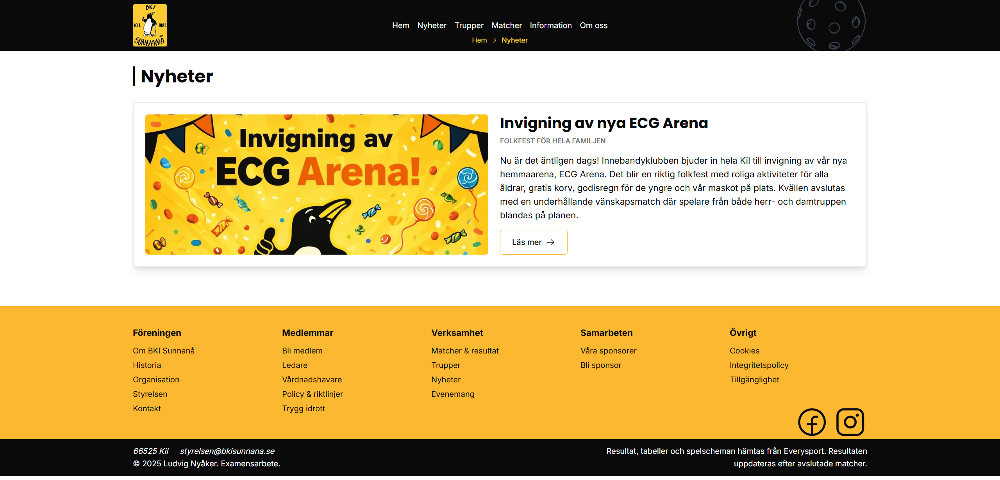

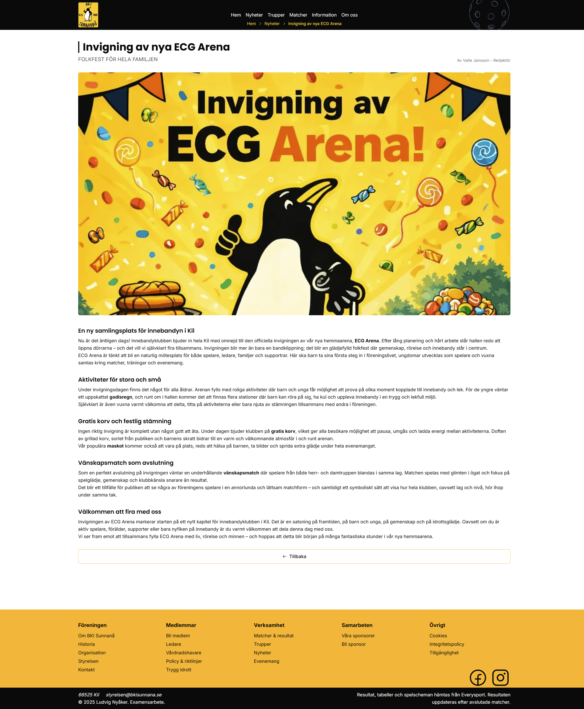

### Matches-page

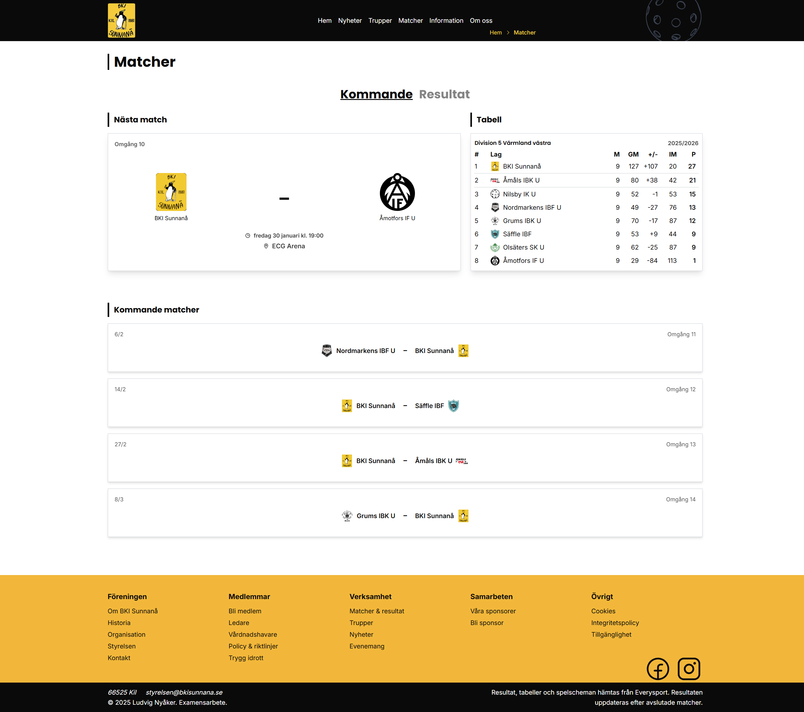

### Team-page


### Player-page

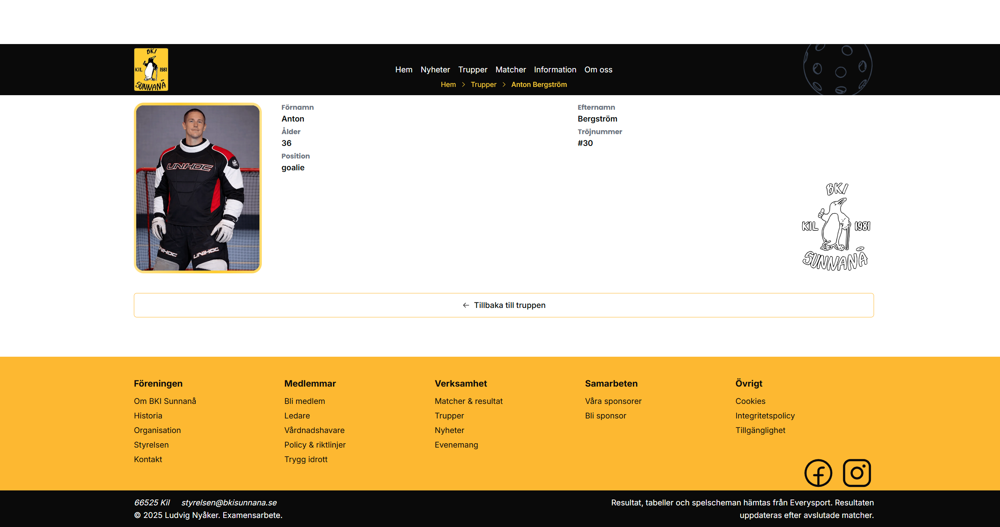

### Information-pages

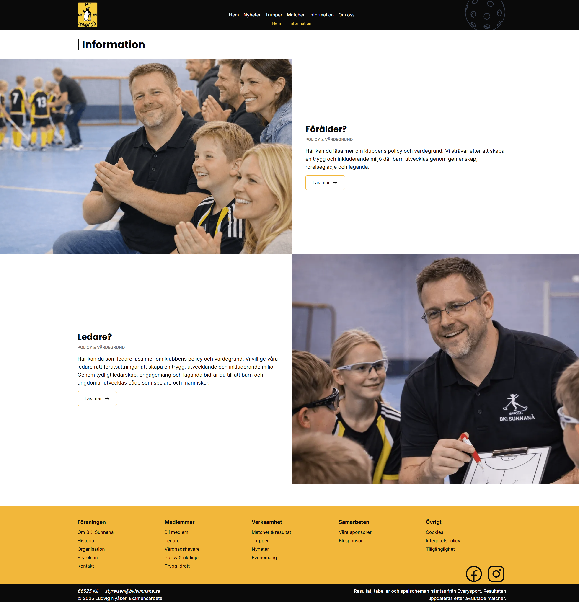

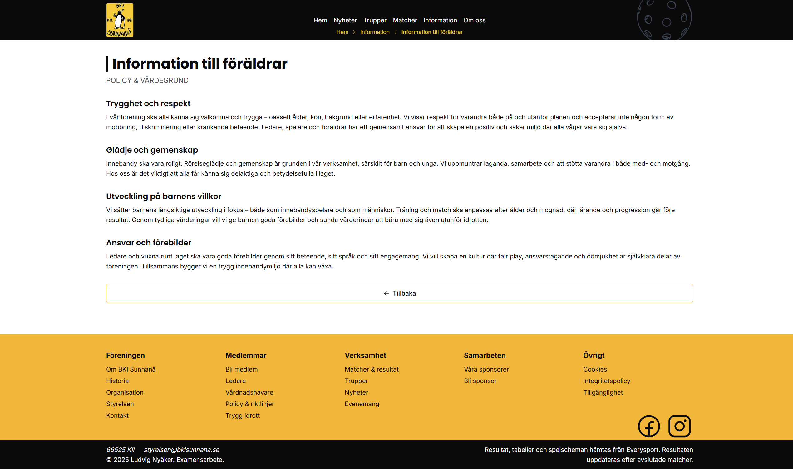

### About-page

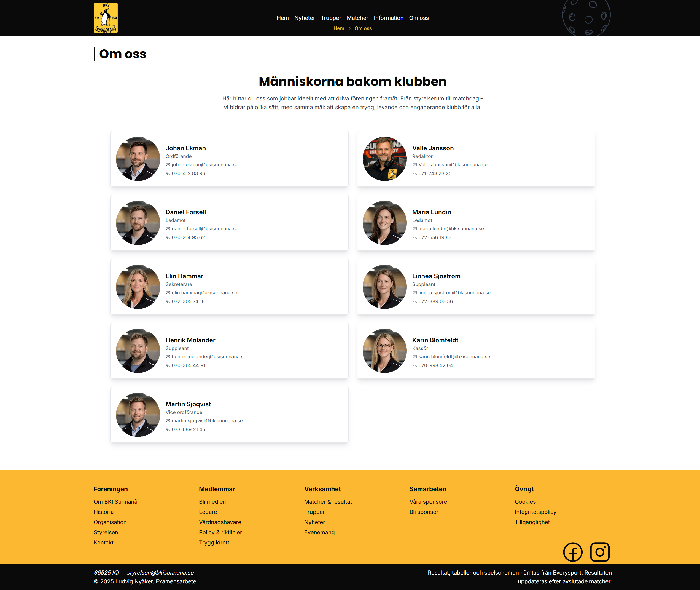

### 404-page

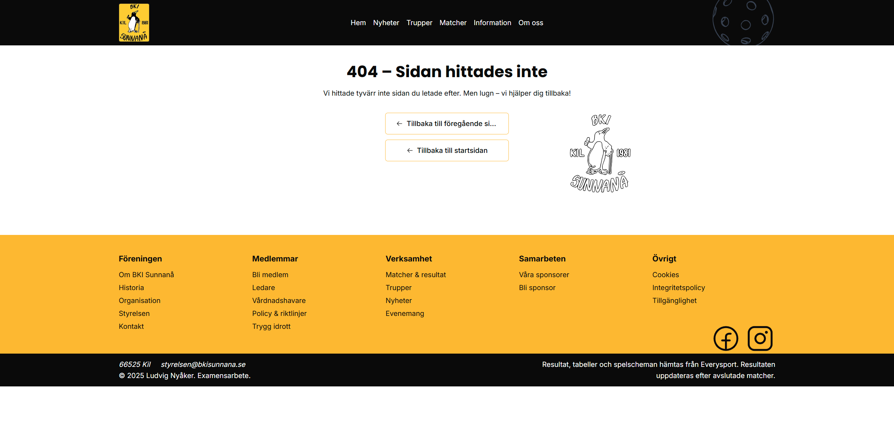


### 📱Mobile📱

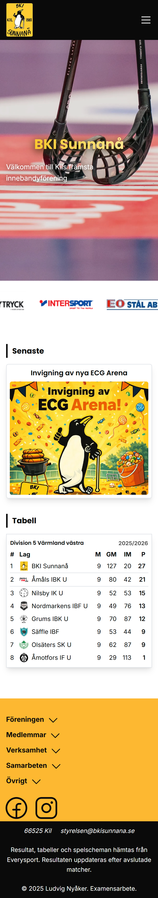

### News-pages

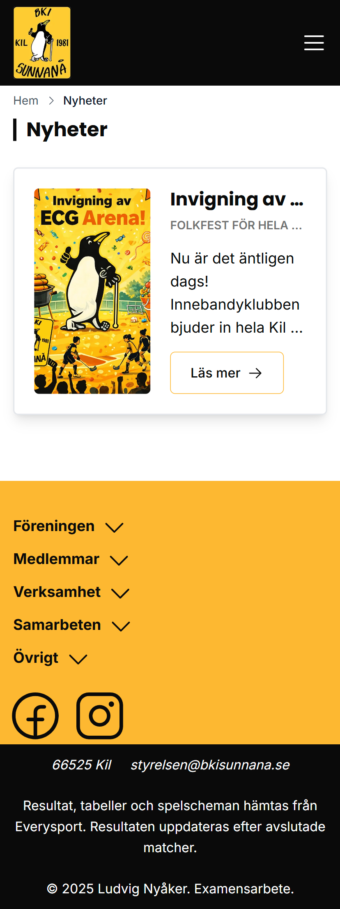

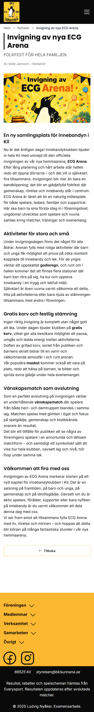

### Matches-page

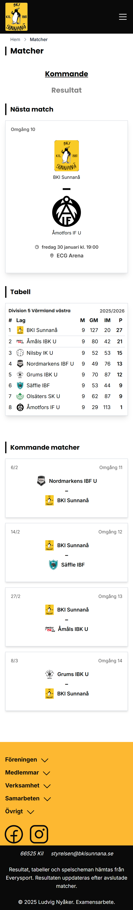

### Team-page


### Player-page

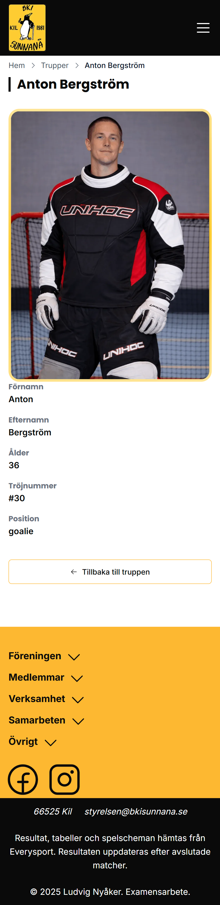

### Information-pages

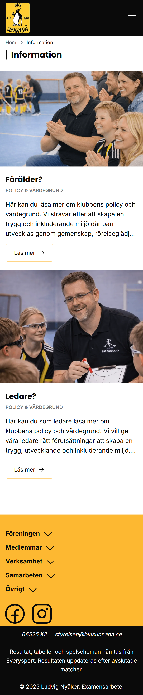

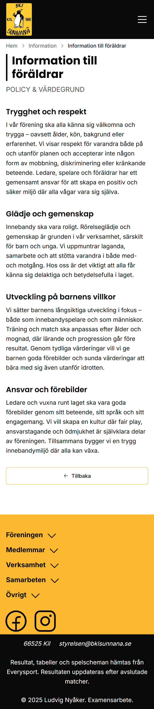

### About-page

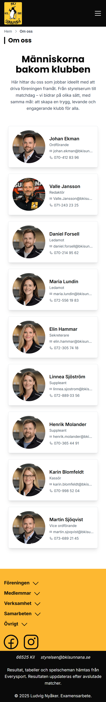

### 404-page

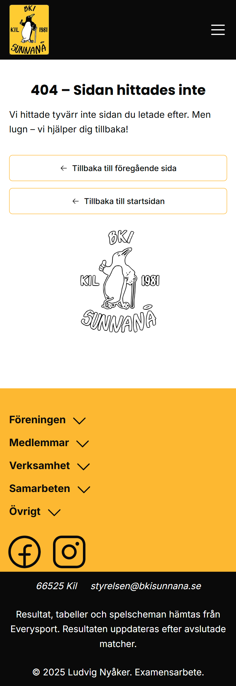


## 👥Target Audience

- Primary: Club members, parents, coaches, volunteers, and sponsors

- Secondary: Potential new members, partners, and community visitors

- Academic / Professional: Teachers, examiners, and developers reviewing the project as a design and technical case study

The project is aimed at demonstrating value through comparison and improvement, rather than deployment.
## 🏗️Application Structure

The application is built as a public-facing website with optional authentication.

### External Data Source – Matches & Tables

Match data (played and upcoming fixtures) as well as league tables are fetched from [Everysport’s public API.](https://app.swaggerhub.com/apis-docs/esmg/Everysport/1.0)

- Displays played matches and upcoming matches

- Displays current league table / standings

- No live score functionality is implemented

- Data is used strictly for informational and demonstrational purposes within this concept project

This integration demonstrates how third-party sports data can be structured, presented, and made accessible in a modern frontend application.

### Public Pages

- Landing page

- News

- Matches (played and upcoming)

- Team & player detail pages

- Information (policies for parents and leaders)

- About

- 404 page


### CMS / Admin

Admin login via Payload CMS

CRUD functionality for pages, news, teams, people, media, and blocks
## ♿ Accessibility & Performance

Accessibility and performance were evaluated using Lighthouse.

### Lighthouse Results

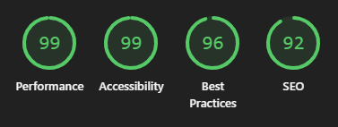

### Accessibility Focus

Accessibility is a core part of the project and follows WCAG AA guidelines:

- Semantic HTML structure

- Keyboard navigation support

- Visible focus states

- ARIA labels and landmarks where needed

- Alt text for all non-text content

- Sufficient color contrast

- Accessibility is validated through:

- Manual keyboard testing

- Lighthouse audits
## 🧪Testing Strategy

- Manual testing via GitHub Issues

- Lighthouse audits (performance, accessibility, SEO)

- CI/CD with GitHub Actions

- Husky for pre-commit linting and quality checks
## 🛠Tech Stack

### Frontend

- 

- 

- 

- 

### Backend / CMS

- Payload CMS

- 

### Tooling & DevOps

- 

- 

- 

- 

- 

### Design & Assets

- 

- Google Fonts

- Phosphor Icons


## 🧪Testing Strategy

- Manual testing via GitHub Issues

- Lighthouse audits (performance, accessibility, SEO)

- CI/CD with GitHub Actions

- Husky for pre-commit linting and quality checks
## 🗄Databas Concept

- NoSQL structure using MongoDB

- Collections instead of tables

- Relationship fields instead of foreign keys

- Central Media collection reused across entities
## 🚀 Run Locally

Follow the steps below to run the project locally.

### 1. Clone the repository

```bash
  git clone https://github.com/LcNyaker/bki-sunnana
```

### 2. Go to the project directory

```bash
  cd bki-sunnana
```

### 3. Install dependencies

```bash
  pnpm install
```

### 4. Configure environment variables

Create a `.env` or `.env.local` file in the root of the project.

Use `.env.example` as a reference and configure the environment variables according to your local setup.

### 5.Start the server

```bash
  pnpm dev
```


## 📈Future Improvements

- Role-based authentication concepts for players, parents, and coaches

- Downloadable policy documents (PDF)

- Add more content and pages

- Improve SEO
# 👤Author / Developer

Ludvig Nyåker
Frontend Developer Student
Medieinstitutet

[Github](https://github.com/LcNyaker)

[LinkedIn](www.linkedin.com/in/ludvig-nyaker-01b275180)

## 📚Reference

References

- [Existing club website (laget.se)](https://www.laget.se/BKISunnana/)

- [WCAG 2.1 Guidelines](https://www.w3.org/TR/WCAG21/)

- [Everysport API](https://app.swaggerhub.com/apis-docs/esmg/Everysport/1.0) – Match schedules and league table data provided by [Everysport](https://www.everysport.com)

## Local sports club websites for inspiration

- [Färjestad BK](https://www.farjestadbk.se/)

- [Karlstad IBK](https://www.karlstadinnebandy.se/)
## 🎉Data Attribution🎉

Match and league table data is provided by [Everysport](https://www.everysport.com).
All rights to the data belong to Everysport and are used in this project solely for educational and non-commercial purposes.
